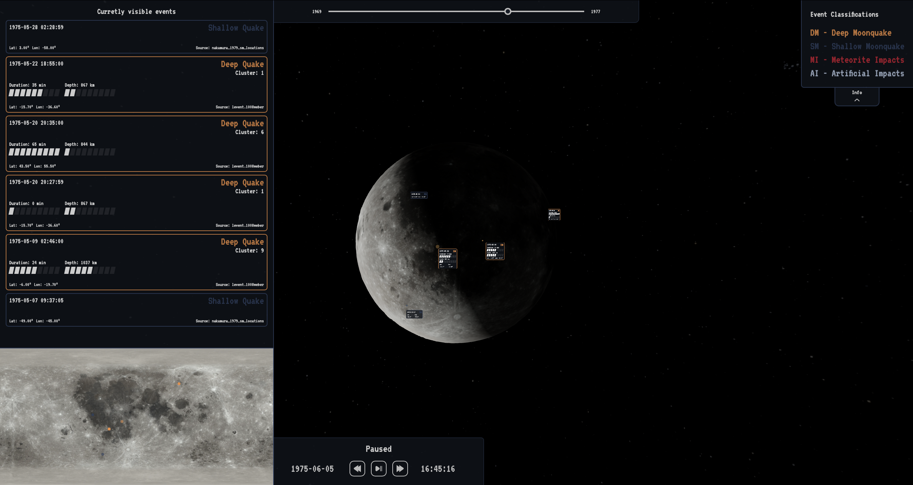

<a name="readme-top"></a>

[![Contributors][contributors-shield]][contributors-url]
[![Forks][forks-shield]][forks-url]
[![Stargazers][stars-shield]][stars-url]
[![Issues][issues-shield]][issues-url]
[![MIT License][license-shield]][license-url]
[![LinkedIn][linkedin-shield]][linkedin-url]

<!-- PROJECT LOGO -->
<br />
<div align="center">
 
<h3 align="center">NASA Moonquake Map</h3>

  <p align="center">
    A 3D map of the moon displaying recorded seismic events from the apollo era. Powered by open data from NASA. Made in 48 hours, 2nd place winner in NASA Space Apps Challenge 2023, Latvia.
    <br />
    <a href="https://cornelius-two.vercel.app"><strong>Try it out »</strong></a>
    <br />
    <br />
    <a href="https://github.com/Zappingmadnnes/NASA-Moonquake-Map/issues">Report Bug</a>
    ·
    <a href="https://github.com/Zappingmadnnes/NASA-Moonquake-Map/issues">Request Feature</a>
  </p>
</div>

<!-- TABLE OF CONTENTS -->
<details>
  <summary>Table of Contents</summary>
  <ol>
    <li>
      <a href="#about-the-project">About The Project</a>
      <ul>
        <li><a href="#built-with">Built With</a></li>
      </ul>
    </li>
    <li>
      <a href="#getting-started">Getting Started</a>
      <ul>
        <li><a href="#prerequisites">Prerequisites</a></li>
        <li><a href="#installation">Installation</a></li>
      </ul>
    </li>
    <li><a href="#usage">Usage</a></li>
    <li><a href="#roadmap">Roadmap</a></li>
    <li><a href="#contributing">Contributing</a></li>
    <li><a href="#license">License</a></li>
    <li><a href="#contact">Contact</a></li>
    <li><a href="#acknowledgments">Acknowledgments</a></li>
  </ol>
</details>

<!-- ABOUT THE PROJECT -->

## About The Project

<!-- [![Product Name Screen Shot][product-screenshot]](https://example.com) -->


A better, simpler and more engaging way to visualize moonquakes to foster excitement and learning.

Explore the fascinating realm of moonquakes with our three.js-powered visualization. Using NASA's open data from 1969 to 1977, we've mapped 1,157 seismic events onto a precise 3D model of the moon, showcasing when and where each occurred. The moon model is detailed, accurately displaying moon phases for added realism.

Our user-friendly interface ensures a straightforward yet enriching experience, allowing anyone to navigate through this wealth of information effortlessly. This project stands as a valuable learning tool, providing a straightforward yet engaging glimpse into the seismic history of the moon. Gain insights with ease and foster excitement for lunar exploration through this accessible and educational tool.

#### Highlights

-   Using NASA open data from 1969 to 1977
-   Fast forward or reverse time
-   1157 Seismic events displayed exactly when and where they happened
-   Highly accurate 3D moon model complete with eclipses and moon phases
-   Stylized and functional UI
-   Second place winner in NASA Space Apps Challenge 2023, Latvia

<p align="right">(<a href="#readme-top">back to top</a>)</p>

### Built With

-   [![Next][Next.js]][Next-url]
-   
-   
-   <a href="https://ascl.net/1112.014"></a>

<p align="right">(<a href="#readme-top">back to top</a>)</p>

<!-- GETTING STARTED -->

## Getting Started

To get a local copy up and running follow these steps.

### Prerequisites

-   npm
    ```sh
    npm install npm@latest -g
    ```

### Installation

1. Clone the repo
    ```sh
    git clone https://github.com/Zappingmadnnes/NASA-Moonquake-Map.git
    ```
2. Install NPM packages
    ```sh
    npm install
    ```
3. Cd into the folder
    ```sh
    cd NASA-Moonquake-Map
    ```
4. Start the project
    ```sh
    npm run dev
    ```

<p align="right">(<a href="#readme-top">back to top</a>)</p>

<!-- CONTRIBUTING -->

## Contributing

Contributions are what make the open source community such an amazing place to learn, inspire, and create. Any contributions you make are **greatly appreciated**.

If you have a suggestion that would make this better, please fork the repo and create a pull request. You can also simply open an issue with the tag "enhancement".
Don't forget to give the project a star! Thanks again!

1. Fork the Project
2. Create your Feature Branch (`git checkout -b feature/AmazingFeature`)
3. Commit your Changes (`git commit -m 'Add some AmazingFeature'`)
4. Push to the Branch (`git push origin feature/AmazingFeature`)
5. Open a Pull Request

<p align="right">(<a href="#readme-top">back to top</a>)</p>

<!-- LICENSE -->

## License

Distributed under the MIT License. See `LICENSE.txt` for more information.

<p align="right">(<a href="#readme-top">back to top</a>)</p>

<!-- CONTACT -->

## Contact

Roberts Mežals - roberts.mezals@gmail.com

Project Link: [https://github.com/Zappingmadnnes/NASA-Moonquake-Map](https://github.com/Zappingmadnnes/NASA-Moonquake-Map)

<p align="right">(<a href="#readme-top">back to top</a>)</p>

<!-- ACKNOWLEDGMENTS -->

## Acknowledgments

-   [NASA Space Apps Challenge](https://www.spaceappschallenge.org)
-   [Renee C. Weber // Lunar Seismology Background ](https://pds-geosciences.wustl.edu/lunar/urn-nasa-pds-apollo_seismic_event_catalog/document/lunar_seismology_background.pdf)

<p align="right">(<a href="#readme-top">back to top</a>)</p>

<!-- MARKDOWN LINKS & IMAGES -->
<!-- https://www.markdownguide.org/basic-syntax/#reference-style-links -->

[contributors-shield]: https://img.shields.io/github/contributors/Zappingmadnnes/NASA-Moonquake-Map.svg?style=for-the-badge
[contributors-url]: https://github.com/Zappingmadnnes/NASA-Moonquake-Map/graphs/contributors
[forks-shield]: https://img.shields.io/github/forks/Zappingmadnnes/NASA-Moonquake-Map.svg?style=for-the-badge
[forks-url]: https://github.com/Zappingmadnnes/NASA-Moonquake-Map/network/members
[stars-shield]: https://img.shields.io/github/stars/Zappingmadnnes/NASA-Moonquake-Map.svg?style=for-the-badge
[stars-url]: https://github.com/Zappingmadnnes/NASA-Moonquake-Map/stargazers
[issues-shield]: https://img.shields.io/github/issues/Zappingmadnnes/NASA-Moonquake-Map.svg?style=for-the-badge
[issues-url]: https://github.com/Zappingmadnnes/NASA-Moonquake-Map/issues
[license-shield]: https://img.shields.io/github/license/Zappingmadnnes/NASA-Moonquake-Map.svg?style=for-the-badge
[license-url]: https://github.com/Zappingmadnnes/NASA-Moonquake-Map/blob/master/LICENSE.txt
[linkedin-shield]: https://img.shields.io/badge/-LinkedIn-black.svg?style=for-the-badge&logo=linkedin&colorB=555
[linkedin-url]: https://linkedin.com/in/linkedin_username
[product-screenshot]: images/screenshot.png
[Next.js]: https://img.shields.io/badge/next.js-000000?style=for-the-badge&logo=nextdotjs&logoColor=white
[Next-url]: https://nextjs.org/
[React.js]: https://img.shields.io/badge/React-20232A?style=for-the-badge&logo=react&logoColor=61DAFB
[React-url]: https://reactjs.org/
[Vue.js]: https://img.shields.io/badge/Vue.js-35495E?style=for-the-badge&logo=vuedotjs&logoColor=4FC08D
[Vue-url]: https://vuejs.org/
[Angular.io]: https://img.shields.io/badge/Angular-DD0031?style=for-the-badge&logo=angular&logoColor=white
[Angular-url]: https://angular.io/
[Svelte.dev]: https://img.shields.io/badge/Svelte-4A4A55?style=for-the-badge&logo=svelte&logoColor=FF3E00
[Svelte-url]: https://svelte.dev/
[Laravel.com]: https://img.shields.io/badge/Laravel-FF2D20?style=for-the-badge&logo=laravel&logoColor=white
[Laravel-url]: https://laravel.com
[Bootstrap.com]: https://img.shields.io/badge/Bootstrap-563D7C?style=for-the-badge&logo=bootstrap&logoColor=white
[Bootstrap-url]: https://getbootstrap.com
[JQuery.com]: https://img.shields.io/badge/jQuery-0769AD?style=for-the-badge&logo=jquery&logoColor=white
[JQuery-url]: https://jquery.com
